<div align="center">

# Sortie

Boot a mech console, forge parts, fire burst modes

[![Live][badge-site]][url-site]
[![HTML5][badge-html]][url-html]
[![CSS3][badge-css]][url-css]
[![JavaScript][badge-js]][url-js]
[![Claude Code][badge-claude]][url-claude]
[![License][badge-license]](LICENSE)

[badge-site]:    https://img.shields.io/badge/live_site-0063e5?style=for-the-badge&logo=googlechrome&logoColor=white
[badge-html]:    https://img.shields.io/badge/HTML5-E34F26?style=for-the-badge&logo=html5&logoColor=white
[badge-css]:     https://img.shields.io/badge/CSS3-1572B6?style=for-the-badge&logo=css3&logoColor=white
[badge-js]:      https://img.shields.io/badge/JavaScript-F7DF1E?style=for-the-badge&logo=javascript&logoColor=black
[badge-claude]:  https://img.shields.io/badge/Claude_Code-CC785C?style=for-the-badge&logo=anthropic&logoColor=white
[badge-license]: https://img.shields.io/badge/license-MIT-404040?style=for-the-badge

[url-site]:   https://sortie.neorgon.com/
[url-html]:   #
[url-css]:    #
[url-js]:     #
[url-claude]: https://claude.ai/code

</div>

---

## Overview

Sortie is a mech cockpit you can actually operate. Seat a device in the core and
the console wakes up: twenty-two components come online one by one, tracing out
from the mark at the centre into a frame. From there you swap parts, paint your
own on a 16 by 16 grid, recolor the whole console, and fire burst modes that
repaint every readout and shift the frame's stats.

It keeps nothing on a server. Parts, colors and loadouts live in your browser,
and a share link carries the whole frame in the URL.

An original homage to the cockpit interfaces of 2010s mecha anime.

**Live:** sortie.neorgon.com

---

## Features

- **Boot ceremony** -- a locked console, a device ID, and a handshake where the mark flies out of the socket into the frame's core, which then grows the machine outward around it
- **Component matrix** -- 21 slots on an Armored Core style frame: head, core, arms and legs, three internals, and four weapon hardpoints
- **Build budgets** -- every part has a weight and an EN load, played against the legs' capacity and the generator's output. Overload is allowed, and it costs you
- **76 stock parts** -- 15 arm units and 10 back units per side, plus frame alternates including reverse-joint and tank legs
- **Forge** -- paint a 16 by 16 glyph in four inks on a grid that is the tile itself, or draw a flat silhouette and let Outline wrap it in a lit contour
- **Burst modes** -- Burst, Siege, Recon and Sprint, each with its own palette, corner readouts and stat multipliers
- **Transformation** -- the frame folds into Flight or Siege form, tiles sliding to new positions with their own palette and stat profile
- **Cockpit HUD** -- six numbered section panels flanking a ringed frame, each reporting real state and flipping to an alert when a budget blows
- **Console options** -- accent picker, three matrix layouts, five effect toggles, four motion levels, synthesized sound
- **Share and export** -- the whole frame packs into a URL hash; parts export to JSON; the build renders to a poster PNG
- **Idle attract mode** -- left alone, the console cycles its modes on its own

---

## The device ID

The console asks for a device ID before it will boot. It is `CORE`, and the page
tells you so after a few seconds.

This is a stage prop. The check runs in your browser against a string in the
source, it protects nothing, and there is nothing behind it to protect, because
every byte this site holds is already in your own browser. It exists because
watching a console refuse you and then relent is more fun than landing on a
finished one.

`?key=CORE` skips it. **Re-lock** in the header replays it.

---

## Keyboard

| Key | Does |
|---|---|
| `C` | Console |
| `F` | Forge |
| `M` | Burst modes |
| `T` | Cycle transformation: Frame, Flight, Siege |
| `O` | Console options |
| `H` | Hide or show the header and footer |
| Arrow keys | Move between matrix tiles |
| `Esc` | Close the dialog, then the drawer, then re-lock the console |

---

## Running locally

ES modules require an HTTP server (not `file://`):

```bash
make serve
```

Then open http://localhost:8863.

---

## Architecture



```
sortie-site/
├── index.html              # Shell: lock screen, console, forge, overlays
├── css/
│   ├── style.css           # Console primitives shared across screens
│   └── parts/
│       ├── tokens.css      # Glow ramp, mode palettes, FX intensity knobs
│       ├── boot.css        # Lock screen and handshake choreography
│       ├── matrix.css      # Tiles, trace lines, boot stagger
│       ├── cards.css       # Part cards and stat bars
│       ├── forge.css       # Glyph painter and preview
│       ├── modes.css       # Burst overlay: ring, banner, quadrants
│       ├── panel.css       # Options drawer
│       └── responsive.css  # Narrow-screen density
└── js/
    ├── app.js              # Entry point
    ├── state.js            # State object + localStorage
    ├── parts.js            # AC6 slot model, 76-part catalog, stat and budget maths
    ├── glyphs.js           # 16x16 four-ink glyph codec and keyline shader
    ├── layout.js           # Slot positions per preset, plus the Flight and Siege forms
    ├── transform.js        # Folding the frame between forms
    ├── boot.js             # Lock screen and unlock sequence
    ├── matrix.js           # Tile placement, traces, keyboard grid nav
    ├── cards.js            # Card rendering (rail, picker, preview)
    ├── forge.js            # Glyph painter and part CRUD
    ├── modes.js            # Burst modes: palettes and multipliers
    ├── theme.js            # Accent application and contrast derivation
    ├── modal.js            # Focus trap shared by the overlays
    ├── fx.js               # Particle field and idle attract loop
    ├── audio.js            # Synthesized blips (off by default)
    ├── panel.js            # Options drawer
    ├── share.js            # Frame encoding to and from the URL hash
    ├── poster.js           # Canvas poster export
    ├── render.js           # Screen routing and readouts
    ├── events.js           # Wiring
    └── utils.js            # Helpers, color maths, download
```

### Glyphs

A part's icon is 16 by 16 pixels at two bits each, stored as 128 hex
characters. The four inks carry meaning rather than being three opacities of
white:

| Ink | Is | Used for |
|---|---|---|
| 0 | transparent | the accent tile shows through |
| 1 | key | the contour, and every cut inside the shape |
| 2 | shade | recessed or secondary surface |
| 3 | light | primary armour surface |

Level 1 being a *colour* is what makes the sprites read. While every level was
white at some opacity, nothing could ever be darker than the tile, so no shape
had a hard edge to sit against and they all looked inflated.

`keyline()` wraps a silhouette in that contour by dilating outward one pixel,
leaving the authored shape intact. It replaced a shader that lit every
top-left boundary pixel and shadowed every bottom-right one: on a typical part
that spent 48 of 70 inked pixels on bevel, and a shape that is mostly bevel
reads as puffy however carefully it was drawn.

Parts are composed rather than drawn freehand, from a small vocabulary of
`rect`, `frame`, `vents`, `taper`, `disc`, `ring` and `mirror`. Forty
independently hand-drawn sprites have forty different stroke weights; a shared
vocabulary is most of what separates an icon set from a pile of icons.

Both earlier formats still decode. 36 characters was 12 by 12 at one bit, 72
was 12 by 12 at two, and each is centred inside the 16 by 16 field rather than
resampled: 12 to 16 is a 4:3 ratio, which duplicates every third column and
wrecks art drawn a pixel at a time.

---

<div align="center">
<sub>Part of <a href="https://neorgon.com/">Neorgon</a></sub>
</div>
